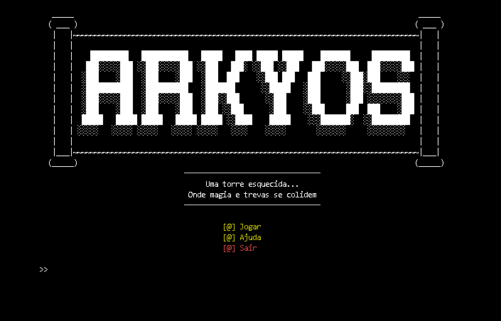
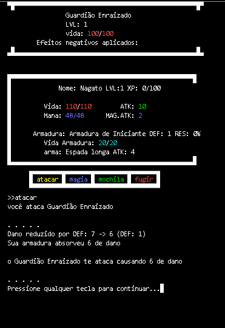
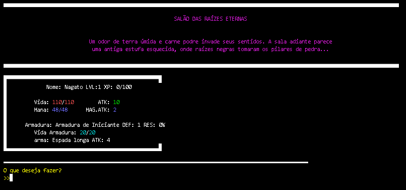

# 🕯️ Arkyos

**No topo de uma torre esquecida pelos deuses, alguém desperta entre ruínas e cinzas...**

Arkyos é uma experiência narrativa e atmosférica, onde o protagonista – sem memória e à beira do colapso – precisa descer os andares de uma **Torre Misteriosa** viva e perigosa. Com ecos de um passado esquecido e fragmentos de poder, você enfrentará criaturas corrompidas, armadilhas mortais e revelações profundas.

> A jornada para escapar é também uma jornada para descobrir quem você é...  
> E por que o mundo parou de girar no exato momento em que você caiu.

---
## Gameplay

O jogo consiste descer a Torre, para isso precisará explorar os locais e enfrentar inimigos que vagam a torre, prepara-se bem Jogador, e boa sorte!

Durante sua jornada você enfrentara situações que testaram sua coragem e determinação:

Todos os andares são vivos e reagem às suas ações. Cada passo conta, cada escolha molda o destino.
Cuidado para deixar nada para trás... sua liberdade depende unicamente de você.

E lembre-se: A morte é permanente... e o esquecimento é eterno.

---

🧩 Principais comandos:

🏃 mover: se locomove pela Torre

👁️ olhar: examina o local(tente, caso não consiga avançar)

📜 status: confere seus atributos

🎒 Mochila: com gerenciamento de itens

🗺️ Mapa: dos andares da torre

---
## 🚀 Instalação e Execução

❗ Para que o jogo funcione perfeitamente, certifique-se que a bibiloteca colorama esteja instalada.
intale através do terminal com comando:
pip install colorama

ou execute o arquivo:
https://files.pythonhosted.org/packages/d1/d6/3965ed04c63042e047cb6a3e6ed1a63a35087b6a609aa3a15ed8ac56c221/colorama-0.4.6-py2.py3-none-any.whl

---
⚙️ Sobre:
TextRpg desenvolvido em python, feito para ser jogado no terminal através de comandos digitados

bibliotecas usadas:
   - sys
   - os
   - time
   - random
   - colorama

---
🙋 Autores:
Desenvolvido por: 
   - Kayck Carvalho
   - Kayo Fabio
   - Paulo Marques

Caso Encontre Algum Bug ou queira dar uma Opinião de Melhorias: rpgdetextofacul@gmail.com

